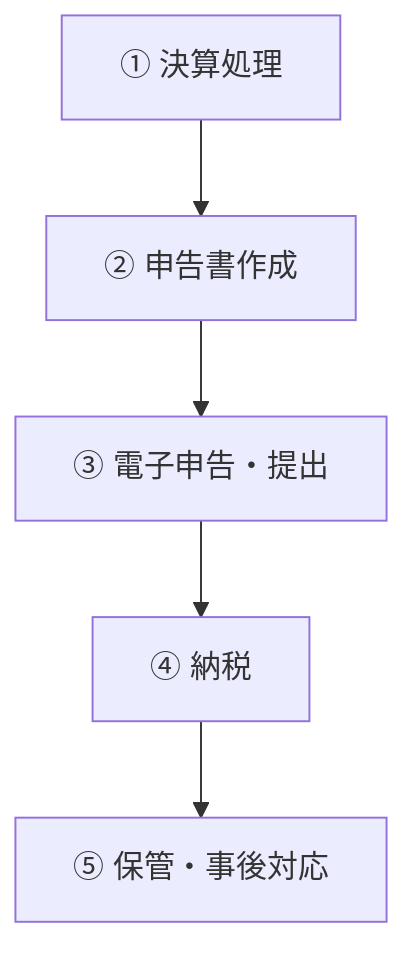
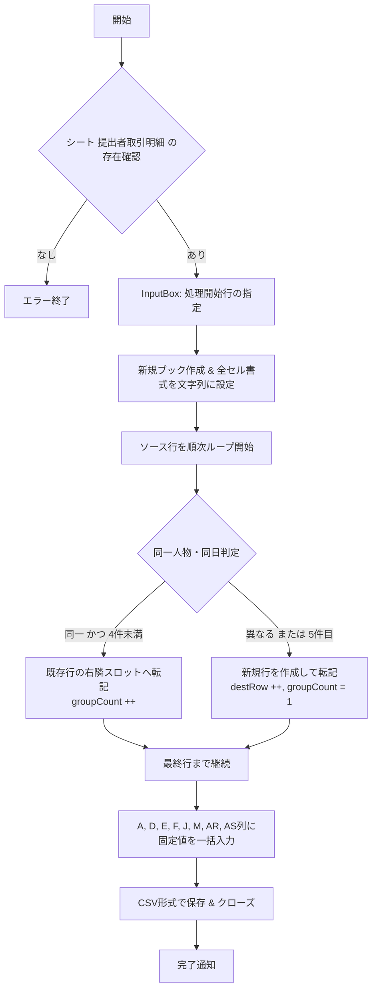

# mermaid-

# 見出し１
##　見出し２
＃ 見出し
[markdown記法リファレンス](https://qiita.com/oreo/items/82183bfbaac69971917f)

# 法人の確定申告 手順まとめ（A4簡易版）

## 1. 申告の概要

| 項目 | 内容 |
|------|------|
| 対象 | 法人（株式会社・合同会社など） |
| 申告期限 | 決算日の翌日から2か月以内（延長申請で＋1か月可） |
| 提出先 | 税務署・都道府県税事務所・市区町村役場 |
| 主な税目 | 法人税・地方法人税・法人住民税・法人事業税 |

---

## 2. 全体の流れ

